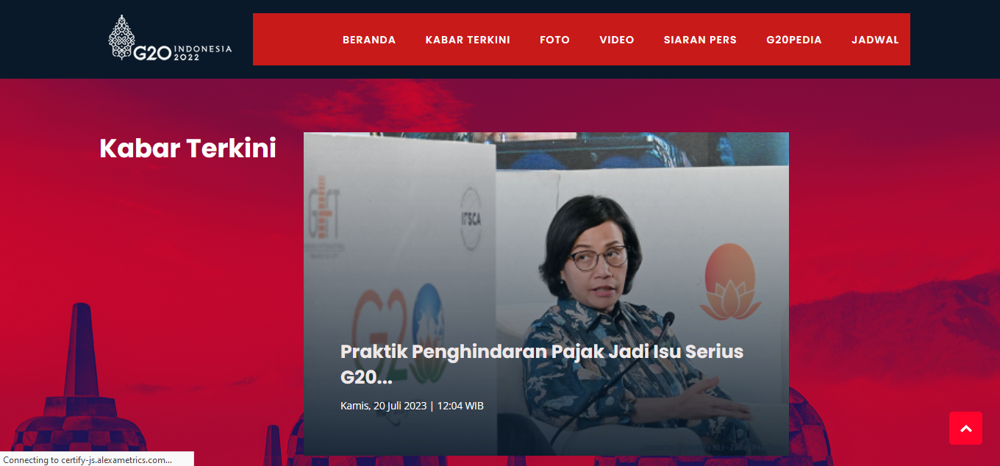

# Redesign website G20 indonesia 2022

# Problem Web:
Meskipun situs web ini memiliki desain yang menarik dan fungsional, terdapat kekurangan pada bagian navbar menu yang terlihat polos. Navbar menu yang polos dapat mengurangi daya tarik visual situs dan membuat pengguna sulit untuk menavigasi dengan mudah. Hal ini juga bisa mengurangi kesan profesionalitas dan kesan modern dari situs web secara keseluruhan. Oleh karena itu, diperlukan penyesuaian pada desain navbar menu untuk meningkatkan tampilan dan fungsionalitas situs secara keseluruhan.

# Solution
Menambahkan background navbar menu. Solusi saya adalah menambahkan latar belakang pada navbar menu untuk meningkatkan daya tarik visual dan membantu membedakan antara konten utama dan menu navigasi. Dengan menambahkan latar belakang, dapat menciptakan tampilan yang lebih menarik dan profesional, sambil tetap mempertahankan fungsi dan navigabilitas yang baik. Latar belakang ini dirancang dengan cermat agar sesuai dengan estetika umum situs web kami, menciptakan konsistensi visual yang kuat di seluruh platform. Dengan demikian, pengguna akan lebih mudah mengidentifikasi dan mengakses opsi menu yang tersedia, meningkatkan pengalaman pengguna secara keseluruhan.

 